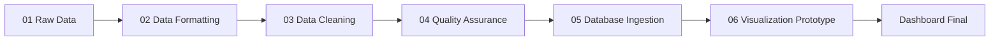

# Analítica de Riesgo de Abandono Escolar en Argentina

[](https://www.python.org/)
[](https://jupyter.org/)
[](https://plotly.com/)
[](https://www.postgresql.org/)

Proyecto de analítica aplicada orientado a identificar señales tempranas de riesgo de abandono escolar en Argentina. Integra datos históricos de matrícula, trayectoria educativa e infraestructura institucional para construir un dashboard ejecutivo con visualizaciones interactivas, segmentación de perfiles críticos y una base metodológica para una futura solución de alerta temprana.

## Tabla de contenidos

- [Descripción del proyecto](#descripción-del-proyecto)
- [Problema de negocio / política pública](#problema-de-negocio--política-pública)
- [Solución analítica](#solución-analítica)
- [Entregables principales](#entregables-principales)
- [Datos utilizados](#datos-utilizados)
- [Pipeline de trabajo](#pipeline-de-trabajo)
- [Preguntas analíticas](#preguntas-analíticas)
- [Dashboard y visualizaciones](#dashboard-y-visualizaciones)
- [Hallazgos principales](#hallazgos-principales)
- [Stack técnico](#stack-técnico)
- [Estructura del repositorio](#estructura-del-repositorio)
- [Configuración local](#configuración-local)
- [Variables de entorno](#variables-de-entorno)
- [Próxima evolución: Machine Learning](#próxima-evolución-machine-learning)
- [Notas de reproducibilidad](#notas-de-reproducibilidad)

## Descripción del proyecto

El objetivo del proyecto es transformar datos educativos públicos en una herramienta de lectura ejecutiva que permita analizar tendencias, comparar segmentos institucionales y priorizar perfiles con mayor exposición al abandono escolar.

La solución no se limita a mostrar métricas históricas: organiza el proceso completo desde archivos crudos hasta un dashboard final, documentando las etapas de formateo, limpieza, aseguramiento de calidad, ingesta SQL y visualización.

## Problema de negocio / política pública

El abandono escolar no suele aparecer de forma aislada ni completamente aleatoria. Antes de consolidarse, puede estar precedido por señales observables como:

- sobreedad escolar;
- salidas sin pase;
- brechas de promoción;
- diferencias por sector de gestión;
- contexto urbano/rural;
- disponibilidad de conectividad y equipamiento institucional.

La pregunta central del proyecto es:

> ¿Podemos identificar perfiles institucionales con mayor riesgo educativo antes de que el abandono se consolide?

## Solución analítica

Se desarrolló un flujo de trabajo de datos que consolida información educativa histórica y la transforma en un dashboard interactivo para análisis exploratorio y toma de decisiones.

La solución incluye:

- consolidación de datasets anuales;
- normalización de estructura y nombres de variables;
- limpieza de datos, tratamiento de nulos y revisión de outliers;
- construcción de tablas analíticas para base relacional;
- ingesta en PostgreSQL / Supabase;
- visualizaciones interactivas con Plotly;
- segmentación de perfiles de riesgo educativo;
- propuesta de evolución hacia un modelo predictivo.

## Entregables principales

| Entregable | Descripción |
| --- | --- |
| [`abandono_escolar_argentina_dashboard.ipynb`](abandono_escolar_argentina_dashboard.ipynb) | Notebook principal con dashboard interactivo, narrativa ejecutiva y visualizaciones de riesgo. |
| [`docs/pipeline.md`](docs/pipeline.md) | Documentación del flujo de datos desde archivos crudos hasta el dashboard final. |
| [`docs/case_study.md`](docs/case_study.md) | Caso de estudio con contexto, metodología, hallazgos y valor del proyecto. |
| [`docs/talk_outline.md`](docs/talk_outline.md) | Guion de presentación para explicar el proyecto en formato portfolio o demo. |
| [`docs/data_dictionary.xlsx`](docs/data_dictionary.xlsx) | Diccionario de datos de apoyo para interpretar variables y tablas. |

## Datos utilizados

El repositorio trabaja con bases educativas históricas de Argentina organizadas por año y temática. Los archivos crudos se encuentran en `01_raw_data/` y los datasets consolidados iniciales en `02_data_formatting/`.

Tablas analíticas principales:

| Dataset | Contenido | Uso analítico |
| --- | --- | --- |
| `Matricula_Secciones_Final.csv` | Matrícula, secciones, sobreedad y segmentación por provincia, departamento, sector y ámbito. | Medición de volumen, estructura escolar y señales de sobreedad. |
| `Trayectoria_Sexo_Final.csv` | Inscritos, promovidos, no promovidos, salidas y egresos por sexo. | Análisis de retención, abandono, egreso y brechas de promoción. |
| `Establecimiento_Caracteristicas_Final.csv` | Infraestructura, conectividad, equipamiento, biblioteca y laboratorio. | Evaluación del contexto institucional y recursos disponibles. |

## Pipeline de trabajo

El proyecto está organizado en etapas numeradas para facilitar trazabilidad y reproducibilidad:



1. **Datos crudos:** organización de archivos originales por año y temática.
2. **Formateo:** concatenación de bases anuales y generación de datasets consolidados.
3. **Limpieza:** selección de campos relevantes, estandarización y preparación analítica.
4. **Aseguramiento de calidad:** tratamiento de nulos, outliers y normalización de texto.
5. **Ingesta SQL:** creación de tablas analíticas y carga en base relacional.
6. **Visualización:** prototipo y dashboard final con narrativa ejecutiva.

## Preguntas analíticas

1. ¿La retención escolar muestra una mejora sostenida o existen señales de estancamiento?
2. ¿Cómo se comporta el flujo de retención entre niveles, años y territorios?
3. ¿Existen diferencias relevantes de promoción por sexo?
4. ¿Qué relación hay entre sobreedad y abandono?
5. ¿La infraestructura tecnológica ayuda a segmentar perfiles de riesgo?
6. ¿Qué perfiles institucionales deberían priorizarse en una futura política de alerta temprana?

## Dashboard y visualizaciones

El dashboard final organiza el análisis en cinco dimensiones:

- **Tendencia histórica:** evolución de salidas sin pase y tasa de abandono.
- **Brecha sociodemográfica:** flujo de retención y promoción por sexo.
- **Sobreedad:** relación entre sobreedad y abandono por provincia.
- **Infraestructura escolar:** comparación según conectividad, equipamiento y recursos institucionales.
- **Perfil de riesgo:** radar analítico que combina abandono, sobreedad y brecha de género.

El notebook principal usa componentes HTML, Tailwind CSS y Plotly para presentar el análisis con una estética de dashboard ejecutivo.

## Hallazgos principales

- La sobreedad aparece como una señal académica relevante para perfilar riesgo de abandono.
- Las diferencias por sector, ámbito y conectividad permiten segmentar perfiles institucionales con mayor precisión.
- El perfil **estatal / rural / sin conectividad** emerge como un segmento crítico para priorizar análisis e intervención.
- La combinación de trayectoria académica e infraestructura institucional ofrece una base sólida para evolucionar hacia un modelo de alerta temprana.

## Stack técnico

| Categoría | Herramientas |
| --- | --- |
| Lenguaje | Python |
| Análisis de datos | Pandas, NumPy, SciPy |
| Datos geográficos | GeoPandas |
| Visualización | Plotly, HTML, Tailwind CSS |
| Base de datos | PostgreSQL, Supabase, SQLAlchemy, psycopg2 |
| Entorno de trabajo | Jupyter Notebook / Google Colab |
| Archivos tabulares | CSV, Excel, OpenPyXL |

## Estructura del repositorio

```text
.
├── 01_raw_data/                         # Datasets crudos por año y temática
├── 02_data_formatting/                  # Formateo, concatenación y datasets consolidados
├── 03_data_cleaning/                    # Limpieza inicial y datasets limpios
├── 04_quality_assurance/                # QA, nulos, outliers y normalización
├── 05_database_ingestion/               # Creación de tablas e ingesta SQL
├── 06_visualization_prototype/          # Prototipo previo de visualización
├── docs/                                # Documentación narrativa y material de portfolio
├── abandono_escolar_argentina_dashboard.ipynb
├── requirements.txt                     # Dependencias del proyecto
└── .env.example                         # Variables de entorno requeridas
```

## Configuración local

1. Clonar el repositorio y entrar al directorio del proyecto.

```bash
git clone <url-del-repositorio>
cd proyecto-final-pp1--
```

2. Crear y activar un entorno virtual.

```bash
python -m venv .venv
source .venv/bin/activate
```

> En Windows, activar con `.venv\\Scripts\\activate`.

3. Instalar dependencias.

```bash
pip install -r requirements.txt
```

4. Configurar variables de entorno a partir del archivo de ejemplo.

```bash
cp .env.example .env
```

5. Abrir el notebook principal.

```bash
jupyter notebook abandono_escolar_argentina_dashboard.ipynb
```

## Variables de entorno

El proyecto contempla conexión a una base PostgreSQL / Supabase. Crear un archivo `.env` local con la siguiente estructura:

```env
DB_USER=
DB_PASSWORD=
DB_HOST=
DB_PORT=6543
DB_NAME=postgres
```

> Por seguridad, las credenciales reales no deben versionarse. El repositorio solo incluye `.env.example` como referencia.

## Próxima evolución: Machine Learning

La evolución natural del proyecto es entrenar un modelo de clasificación para identificar instituciones o segmentos con alto riesgo de abandono escolar.

Variable objetivo sugerida:

```text
alto_riesgo = 1 si una institución o segmento presenta caída fuerte de retención, caída de egreso o tasa elevada de salidas sin pase.
alto_riesgo = 0 en caso contrario.
```

Variables candidatas:

- tasa de abandono;
- tasa de sobreedad;
- brecha de promoción por sexo;
- sector de gestión;
- ámbito urbano/rural;
- provincia y departamento;
- conectividad;
- equipamiento institucional;
- indicadores históricos de trayectoria.

Modelos candidatos:

- regresión logística;
- árbol de decisión;
- Random Forest;
- Gradient Boosting.

## Notas de reproducibilidad

- El dashboard principal puede requerir conexión a la base configurada en las variables de entorno.
- Algunas visualizaciones geográficas descargan recursos externos durante la ejecución del notebook.
- Los archivos crudos se preservan para mantener trazabilidad del proceso completo.
- Este repositorio nace de un proyecto académico y fue reorganizado como caso de portfolio profesional, priorizando claridad técnica, seguridad de credenciales y narrativa ejecutiva.
